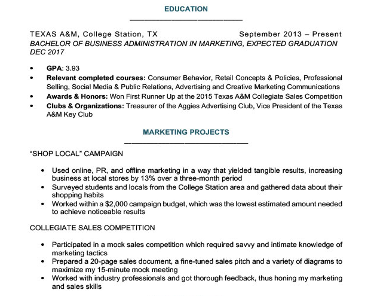
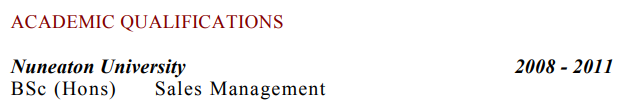
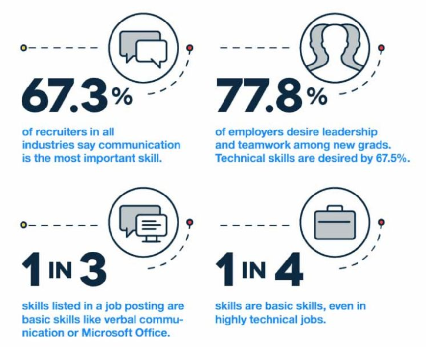
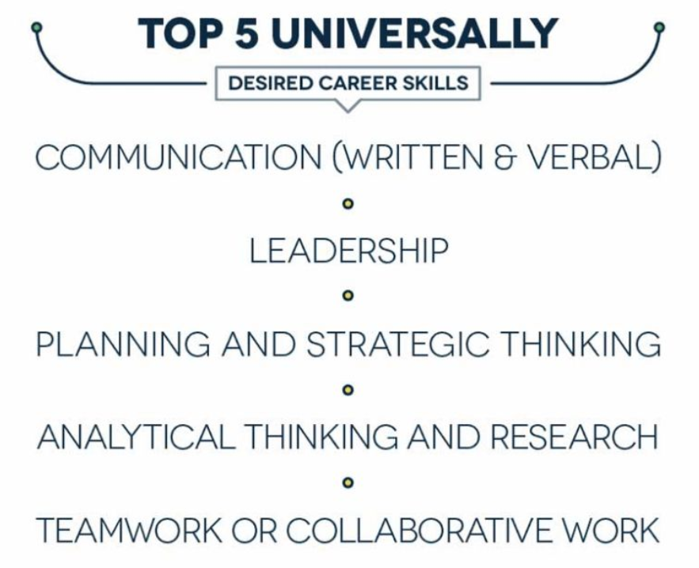
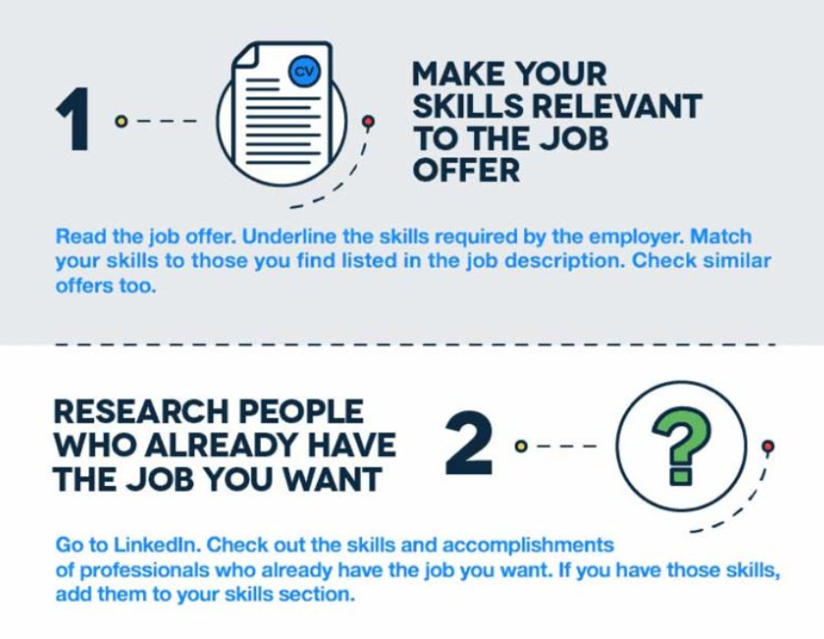
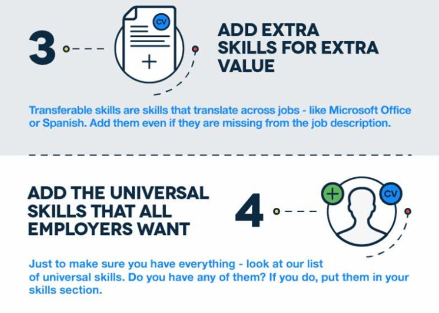
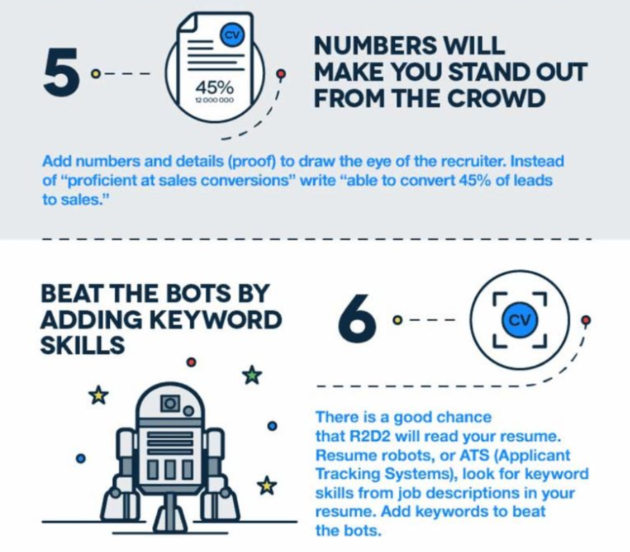

```{r setup, include=FALSE}
knitr::opts_chunk$set(echo = TRUE)
```

# Introduction
This document serves as a summary of quite a few resources on writing a resume. I have added in components specific to your goals as budding data scientists. The topics we will cover are:

1. Format and Media
2. Resume Content / Outline

*******************************************************************************

</br>


# Resume Format and Media

> **Did you know?** HR managers spend on average less than six seconds looking at your resume.

The formatting and layout of your resume answers the most important question of all: should I keep looking at this resume?


## Format and Visual Rhetoric


## Media


*******************************************************************************

</br>


# Resume Content and Outline

> **Tip for Success:** Your resume should rarely--if ever--be longer than two pages. As you gain education and experience, less important education and experience should be left off.

## Overview
### Industry
A technical resume for entry-level industry candidates should have the following sections:

1. Overview and Personal Statement
2. Education
3. On-the-job Experience
4. Awards
5. Skills (not otherwise mentioned in the **Work Experience** section)

This order is not required, but usually recommended. Keep education before work experience until you have more contiguous, relevant, industry experience than you have graduate education--one to two years for someone with a master's.

### Academia
A technical resume for an associate scientist or junior faculty will have the following additional sections:

a. Grants (as PI, Co-I, scientist in a role, sponsored student, etc)
b. Publications (peer reviewed first, then in revision, then under review last)
c. Teaching (highlight any classes where you were the instructor of record)
d. Presentations (highlight invited talks or posters)
e. Abstracts (especially if published)
f. Department Service (edited papers or grants, consulting, school panels, etc)

These sections often slot somewhere between 2 and 4 of the industry outline.


### Overview and Personal Statement

> **Tip for Success:** Include a short personal statement. Facts can impress, but stories are memorable.

I once saw a factoid that HR people are [twice as likely](https://www.kickresume.com/en/help-center/how-write-profile-resume/) to call a candidate who's resume has a personal statement than a candidate without one. Recall that you have six seconds to impress: use the personal statement to tell the story of you and why you are special. A personal statment is a taste of the rest of the dish; it's often 3-5 bullet points or formatted sentences.

Here are some strategies to help you write a good personal statement:

1. __Put the personal statement *first*, but write it *last*__. The personal statement should be the "highlight reel" of the rest of the resume. That means that you should write the rest of the resume first, and then pick the best parts to go into the professional summary.
2. __Tailor your personal statement to the job you have targeted.__ After you have written your resume, read the job posting in detail. Frame your best accomplishments using the nouns and verbs that are used in the job posting itself. You aren't changing the whole resume for each job, just how the HR people will see it. Also, by using the same keywords as the job posting, you are more likely to have an automated search engine flag your resume for human inspection.
3. __Teaser $\rightarrow$ Trailer $\rightarrow$ Movie.__ Your personal statement is the teaser: it should convince the reviewer to read the rest of your resume. Your resume is the trailer: it should convince the reviewer to interview you. You are the movie: make sure you are good enough so that the person who interviews you tells other people about you.
4. __Use numbers/details make your story tangible.__ You are telling the hiring manager the story of how you make money, but make sure to include concrete details of *how many*, *how much*, and *how often*. Compare "Hercules cleaned the royal stables" to "Hercules cleaned the 1000-horse stables of King Augeas in one day". Which sounds more impressive?


Here are a few examples:

#### Professional Summary
A professional summary is a quick highlight of your experience meeting your employers' goals. Most employers care about one thing--making money. This means that you should frame your career highlight to answer the question "How will this candidate make me money?"

> 
> 
> 


#### Resume Objective
What if you don't have a lot of relevant work experience? In this case, tell the HR people what you *will do* do for them. Here's an example:

> 
> 
> 


### Education
At the early stages of your career, this section should be the most important after the Professional Summary. If you don't have many degrees to include, include lines highlighting the projects you worked on and your achievements.

As you gain work experience, this section will grow less and less important. 


#### Early Career Example
At this point, you have only recently graduated, or have not yet graduated. You probably don't have much experience at all. In these cases, highlight the key components of your education that you believe give you the most attractiveness to HR staff in your desired industry.

> 
> 
> 

#### 5+ Year Experience Example
Once you have put in 5-10 years of work, let your work speak for itself. 

> 
> 
> 


### Work Experience
At the early stages of your career, this section will often be rather sparse. Simply mention the jobs you have held and for which companies you worked. Once you have a year of work experience, add bullets under each __title__ you have had to explain the results you achieved in that role. 

> 
> 
> 


### Awards
The awards you should include should help [tell your story](https://www.petersons.com/blog/career-planning-resume-writing-honors-awards-and-accomplishments/). If possible, put awards that you earned on the job or during school in their relevant sections. However, if you have additional awards that you have earned, *that clearly exhibit a facet of your character you would like to highlight*, then add a seperate section for awards near the bottom of the page. It's nice that you won the "Miss Idaho Potato Beauty Pageant", but it doesn't help convince a future boss that you can finish reports on time.

For awards, include:

- Title: "Employee of the Month"
- Date: "February 2017"
- Details: 
    + Exclusivity: "out of 38 employees"
    + Scope: "store-wide"
    + Reason: "for boosting sales 3% above expectations"
    
The details are where you get to cement that you have already done the tasks people are going to hire you for. The awards don't change, but you can certainly tailor the details of the description to the specific industry. In the above example, this decscription is sales-specific. If this person were applying to a management role, I'd say "for collaborating with sales associates to increase revenue". The award stays the same, but the details of it change based on the story you are trying to tell.

### Skills
At the early stages of your career, this section should be the most important after the Professional Summary and Education. As you gain work experience, you will add new skills to this section, but you will probably discard some of the less-valuable skills. Use the skills section to list all the technical proficiencies, languages, softwares, and important "soft skills" (like "multi-tasking", "teamwork", "creativity", or some other flowery horsecrap) you can think of. Because you don't have to descibe them, this section takes up very little space.

#### Beat the Robot
Often, this section will not need to change between applications, because it's simply a list of things you can do. However, in the age of computers, many places will have a computer scan you resume first to ensure that you list the skills specified in the job description. Use a tool like [JobScan](https://www.jobscan.co/) to compare your resume against the job posting. When you find a "skill" requested in the job posting that you know how to do, add it to your skills section.

#### Convince the Human
Once we make it to the humans, however, it's better that your education and work experience *prove* you have the skills you claim to have. Thus, if you want people to know that you can use Excel, put Excel in your skills section, but also add a line somewhere else in the resume where you state how you solved a problem with Excel. "I'm proficient with Excel" says one thing; "Managed client look-up tables and built mailing lists with Excel and Outlook" says something **totally** different.

#### Zety Skills Summary

##### Important Skills


##### Top-5 Soft Skills


##### Adding Skills: Steps to Success








[Source](https://zety.com/blog/what-skills-to-put-on-a-resume)
